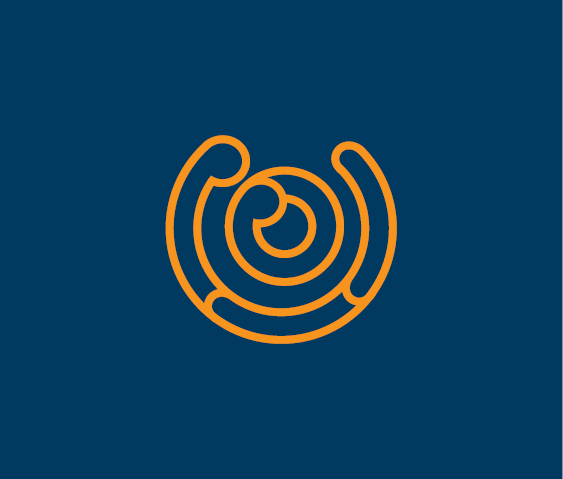
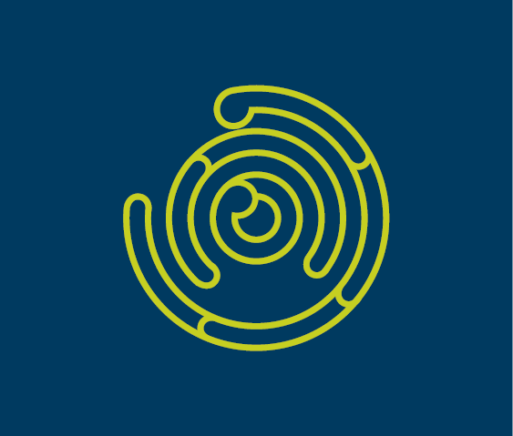
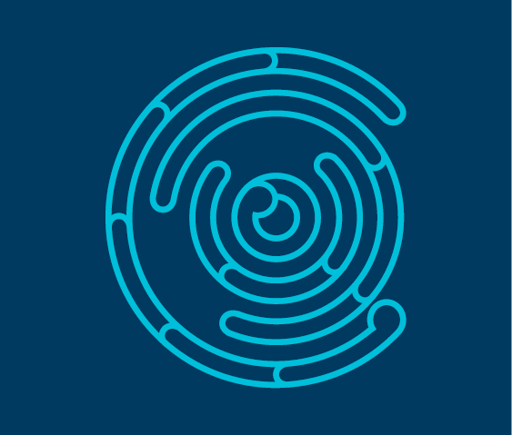

# 02 — Brand and Visual Language

## 4.1 Brand positioning

Creative New Zealand exists to make the arts of Aotearoa flourish. Its own brand must therefore be present but not loud — a confident frame around the work of artists, not a competing voice. The brand expression is typographic, typographically serious, spatial (plenty of whitespace), bicultural (English and te reo Māori carry equal weight in intention, if not yet in coverage), and warm — never corporate-cold, never performatively creative.

## 4.2 The logo


*CNZ primary logo (sourced from live site)*

The primary mark has four parts, sitting together:

1. A yellow/gold koru flourish to the left — a single hand-drawn spiral in CNZ’s signature mustard.
1. A charcoal block containing the word "creative" in white italic serif.
1. The letters "nz" in large italic gold serif, breaking slightly out of the block — intentional asymmetry.
1. A lockup line below: ARTS COUNCIL OF NEW ZEALAND TOI AOTEAROA in letter-spaced sans-serif small caps.

### Usage rules

- **Clear space** on all sides equal to the height of the "c" in "creative". Enforce in CSS with padding on the logo container.
- **Minimum size:** 160px wide on screen for the full lockup; use the stacked short mark below 160px.
- **Never** recolour, stretch, rotate, or place over a busy image without a solid panel behind it.
- **Dark mode:** The charcoal block inverts to off-white with dark text; the gold stays gold. Request the dark-mode asset from CNZ — do not recolour the supplied asset yourself.
- The logo links to / from the header.

## 4.3 The koru motif

The site’s single strongest visual asset. Concentric circular forms with rounded ends, reminiscent of fingerprints or growth rings — they read simultaneously as Māori koru (unfurling fern), as growth and development, and as a signature that is recognisably CNZ-owned.



*koru-orange — Early career artists*



*koru-lime — Artists and practitioners*



*koru-cyan — Arts organisations and groups*


*watermark-bottom — multi-colour cluster used on section landers*

### Usage rules for the koru

- Use the koru as category colour-coding in the primary funding hub (preserve existing colour-to-audience mapping).
- Use at large scale — small koru read as clip art. If you need small variants, commission reduced-complexity versions rather than shrinking these.
- The koru is the primary illustrative element. Don’t add stock photos alongside it. One decisive illustration beats three small photos.
- Can be extended to new categories (ngā toi Māori, Pacific arts, results, news) by commissioning new colour variants against the deep navy ground. Keep line weight consistent.
- **Do not animate the koru spinning** — that would read as disrespectful of the Māori cultural reference. Subtle scroll-linked parallax (≤ 30px) is acceptable and must respect `prefers-reduced-motion`.

## 4.4 Voice

- **Clear and direct.** This is a public funding body; applicants are often anxious and time-pressured. Every sentence should reduce friction.
- **Respectful.** Addresses artists, ringatoi, and communities as peers and partners, not beneficiaries.
- **Bilingual-aware.** Uses te reo Māori naturally where it belongs — place names, organisational names (Toi Aotearoa, Ngā Toi Māori), concepts that have no direct English equivalent (kaupapa, mana, whakapapa) — without gratuitous sprinkling. Never translates concepts where the te reo word is the point.
- **Plain English.** Government plain-language conventions. Short sentences. Active voice. Avoid jargon ("stakeholder", "going forward").
- **Specific, not hype.** "Applications close 12 April" beats "Apply now!!".

### Do / Don’t

| **Do** | **Don’t** |
| --- | --- |
| "Applications close at 5pm on 12 April." | "We’re excited to announce that applications will be closing shortly!" |
| "You can apply if you’re an NZ resident and have been working as an artist for at least two years." | "Our programme is open to a wide variety of candidates across many different backgrounds." |
| "We fund new work by individual artists." | "We empower creatives to unlock their potential." |
| Active voice: "We assess applications within 8 weeks." | Passive: "Applications are assessed within 8 weeks." |
| "We" for CNZ, "you" for the reader. | Third-person about CNZ ("CNZ provides..."). |

## 4.5 Words to never write

- "Stakeholders" — say who you mean.
- "Leveraging" / "unlocking" / "unleashing" / "reimagining".
- "At the end of the day" / "going forward" / "at this point in time".
- "Our community" as a euphemism.
- "Journey" as a synonym for "process" — except in "Our change journey" (existing named programme).
- "Exciting" about CNZ’s own announcements — let the work be exciting.

---

## Design System

Implementation target: Tailwind CSS v4 with a custom theme, plus CSS variables for runtime theming. All tokens exposed as `:root` custom properties so they can be consumed outside Tailwind (e.g. SVG fills).

> **Note:** **Note on colour values**
> Hex values below are sampled from the live site and from the supplied brand assets. Treat as inferred — confirm against the CNZ brand book before sign-off.

## 5.1 Colour tokens — core

| **Token** | **Hex** | **Use** |
| --- | --- | --- |
| --color-ink | #1A1A1A | Primary text, logo block background |
| --color-paper | #FAF8F3 | Page background (warm off-white) |
| --color-paper-alt | #F2EEE4 | Alternating section background |
| --color-gold | #D4A43C | CNZ signature — "nz" in logo, key accents |
| --color-gold-deep | #A87E21 | Gold on light backgrounds where AA contrast is required |

## 5.2 Colour tokens — category / accent

Used for category colour-coding (audience groups, artform tags) and the koru motif variants.

| **Token** | **Hex** | **Pairs with** |
| --- | --- | --- |
| --color-navy | #0B2F4B | Background for koru illustrations; heroic panels |
| --color-orange | #E88B2F | Early career artists |
| --color-cyan | #2BA8C8 | Arts organisations and groups |
| --color-lime | #C4D046 | Artists and practitioners |
| --color-coral | #D45C4A | Reserved — e.g. Ngā Toi Māori |
| --color-plum | #6B3F6E | Reserved — e.g. Pacific Arts |

## 5.3 Colour tokens — functional

| **Token** | **Hex** | **Use** |
| --- | --- | --- |
| --color-success | #2E7D4F | Success messaging |
| --color-warning | #B86A00 | Warnings (deadline approaching) |
| --color-error | #B3261E | Form errors, critical alerts |
| --color-info | #1F6B95 | Informational banners |
| --color-muted | #6B6B6B | Secondary text |
| --color-border | #D9D4C7 | Dividers, card borders |
| --color-focus | #0066CC | Focus ring |

## 5.4 Contrast matrix (WCAG 2.2 AA)

- Body text — `ink` on `paper`: ~15:1 ✓
- Muted text — `muted` on `paper`: ~5.2:1 ✓ (AA normal)
- Gold on paper — `gold` on `paper`: ~2.9:1 ✗ — use `gold-deep` for text
- Orange/Cyan/Lime on paper: all below 3.1:1 — decorative only, never as text.
- White on navy: ~14:1 ✓
- **Rule:** accent colours are for surfaces and illustration, not text. Text goes on ink-on-paper, paper-on-navy, or ink-on-paper-alt.

## 5.5 Typography

| **Role** | **Family** | **Notes** |
| --- | --- | --- |
| Display / Headings | Source Serif 4 | Variable font; weights 400–800. Humanist serif echoing the logo italic serif. Excellent macron support. Open-source. |
| Body / UI | Inter | Variable; 400/500/600/700. Excellent macron rendering and bilingual readability. |
| Mono | JetBrains Mono | Used for code/URLs only. |

**Loading:** self-host or use `next/font/google`. Serve only the weights used.

### Type scale

| **Token** | **Size (desktop)** | **Line-height** | **Weight** | **Usage** |
| --- | --- | --- | --- | --- |
| --fs-display-1 | clamp(2.75rem, 5vw, 4.5rem) | 1.05 | 600 | Hero headline, home only |
| --fs-display-2 | clamp(2.25rem, 4vw, 3.5rem) | 1.1 | 600 | Section landing hero |
| --fs-h1 | clamp(2rem, 3vw, 2.75rem) | 1.15 | 600 | Page H1 |
| --fs-h2 | 1.75rem | 1.2 | 600 | Section H2 |
| --fs-h3 | 1.375rem | 1.3 | 600 | Sub-section |
| --fs-h4 | 1.125rem | 1.35 | 600 | Card title |
| --fs-body-lg | 1.125rem | 1.6 | 400 | Intro paragraphs |
| --fs-body | 1rem | 1.65 | 400 | Body copy |
| --fs-body-sm | 0.9375rem | 1.55 | 400 | Captions, metadata |
| --fs-ui | 0.875rem | 1.4 | 500 | Buttons, nav, labels |
| --fs-eyebrow | 0.75rem | 1.4 | 600 | Tag/category labels; uppercase |

### Type rules

- Body copy uses Inter, not the serif. The serif is a display face.
- **Measure: 60–75ch** for body copy on content pages. Use `max-w-[68ch]` in Tailwind.
- Italics echo the logo — use intentionally for pull quotes and occasional emphasis, never systematically.
- **Macrons must render correctly.** Test ā ē ī ō ū Ā Ē Ī Ō Ū in every chosen weight in the browser before committing to the typeface.
- No full-uppercase paragraphs. Uppercase is reserved for eyebrow labels and always letter-spaced.

## 5.6 Spacing

8px base unit.

| **Token** | **Value** | **px** |
| --- | --- | --- |
| --space-0 | 0 | 0 |
| --space-1 | 0.25rem | 4 |
| --space-2 | 0.5rem | 8 |
| --space-3 | 0.75rem | 12 |
| --space-4 | 1rem | 16 |
| --space-5 | 1.5rem | 24 |
| --space-6 | 2rem | 32 |
| --space-7 | 3rem | 48 |
| --space-8 | 4rem | 64 |
| --space-9 | 6rem | 96 |
| --space-10 | 8rem | 128 |

**Section vertical rhythm:** between major sections, use `--space-9` on desktop / `--space-7` on mobile.

## 5.7 Layout

- **Container max-width:** 1280px (`--container`).
- **Grid:** 12-column with 24px gutters on desktop, 4-column with 16px on mobile.
- **Content width:** 680px (`--content`) — ~68ch.
- **Breakpoints (Tailwind):** `sm 640` · `md 768` · `lg 1024` · `xl 1280` · `2xl 1536`.

## 5.8 Radii, borders, shadows

| **Token** | **Value** | **Use** |
| --- | --- | --- |
| --radius-sm | 4px | Inputs, tags |
| --radius-md | 8px | Cards, buttons |
| --radius-lg | 16px | Large feature panels |
| --radius-full | 9999px | Pills |

**Borders:** `1px solid var(--color-border)`. 2px for emphasised / focused states.

**Shadows:** use sparingly. Government/institutional visual language is flatter. Reserve shadows for modals and dropdowns.

```
--shadow-sm: 0 1px 2px 0 rgb(0 0 0 / 0.05);
--shadow-md: 0 4px 12px -2px rgb(0 0 0 / 0.08);
--shadow-lg: 0 12px 32px -8px rgb(0 0 0 / 0.12);
```

## 5.9 Motion

- **Default duration:** 200ms
- **Entry easing:** `cubic-bezier(0.2, 0, 0, 1)`
- **Exit easing:** `cubic-bezier(0.4, 0, 1, 1)`
- Scroll-linked motion (koru parallax, headline reveal) allowed at ≤ 30px magnitude.
- **All motion must respect** `prefers-reduced-motion: reduce`. No exceptions.

## 5.10 Focus states

- **Visible on every interactive element.** A 2px solid `--color-focus` outline with 2px offset is the default.
- Do not rely on :hover alone to indicate interactivity.
- Links in body copy are underlined; the hover state thickens the underline and darkens the text.

## 5.11 Iconography

- **Library:** `lucide-react` as the default icon set.
- **Size:** 16px (inline), 20px (UI default), 24px (prominent CTAs).
- **Stroke weight:** 1.75px — slightly heavier than Lucide default for better rendering at small sizes.
- **Custom icons** (koru variants, artform icons) live in `components/icons/` as typed React components.

## 5.12 Tailwind config snippet

```
// tailwind.config.ts
export default {
  theme: {
    extend: {
      colors: {
        ink: 'var(--color-ink)',
        paper: { DEFAULT: 'var(--color-paper)', alt: 'var(--color-paper-alt)' },
        gold: { DEFAULT: 'var(--color-gold)', deep: 'var(--color-gold-deep)' },
        navy: 'var(--color-navy)',
        orange: 'var(--color-orange)',
        cyan: 'var(--color-cyan)',
        lime: 'var(--color-lime)',
        coral: 'var(--color-coral)',
        plum: 'var(--color-plum)',
        muted: 'var(--color-muted)',
        border: 'var(--color-border)',
        focus: 'var(--color-focus)',
      },
      fontFamily: {
        serif: ['"Source Serif 4"', 'Georgia', 'serif'],
        sans: ['Inter', 'system-ui', 'sans-serif'],
        mono: ['"JetBrains Mono"', 'ui-monospace', 'monospace'],
      },
      maxWidth: { container: '1280px', content: '680px' },
      borderRadius: { sm: '4px', md: '8px', lg: '16px', full: '9999px' },
    },
  },
};
```

## 5.13 Dark mode

**Not required for v1.** The brand sits in a warm-light palette. If added later: `paper` → deep warm charcoal (#1C1A15), `ink` → warm off-white (#F5EEDE), navy stays navy, accents unchanged. Do not ship a half-baked dark mode.
